 
## 查看主页获取源码

### 一、作品包含

源码+数据库+设计文档万字+PPT+全套环境和工具资源+部署教程

### 二、项目技术

前端技术：Html、Css、Js、Vue、Element-ui

数据库：MySQL

后端技术：Java、Spring Boot、MyBatis

  

### 三、运行环境

开发工具：IDEA/eclipse

数据库：MySQL5.7

数据库管理工具：Navicat10以上版本

环境配置软件： JDK1.8+Maven3.6.3

前端Nodejs：14

### 四、项目介绍
项目编号：springbootA167

高校竞赛管理系统背景在于应对高校竞赛活动日益频繁和复杂的挑战。随着高校竞赛的种类和数量不断增加，传统的管理方式已无法满足高效、精确的组织和管理需求。因此，开发一套集成化、智能化的竞赛管理系统，对于提高竞赛组织效率、简化报名流程、实现资源优化配置具有重要意义。该系统能够流程的数字化管理，从而提升整体竞赛活动的质量和水平。

前台用户功能：浏览首页、竞赛项目、公告信息、后台管理、个人中心。

后台分为管理员、学生、老师
管理员的功能：系统首页、个人中心、学生管理、老师管理、竞赛类别管理、竞赛项目管理、学生报名管理、老师报名管理、学生打卡管理、老师打卡管理、学生成果管理、老师成果管理和系统管理。
学生的功能：系统首页、个人中心、学生报名管理、学生打卡管理、学生成果管理。
老师的功能：系统首页、个人中心、老师报名管理、老师打卡管理、老师成果管理。

### 五、运行截图

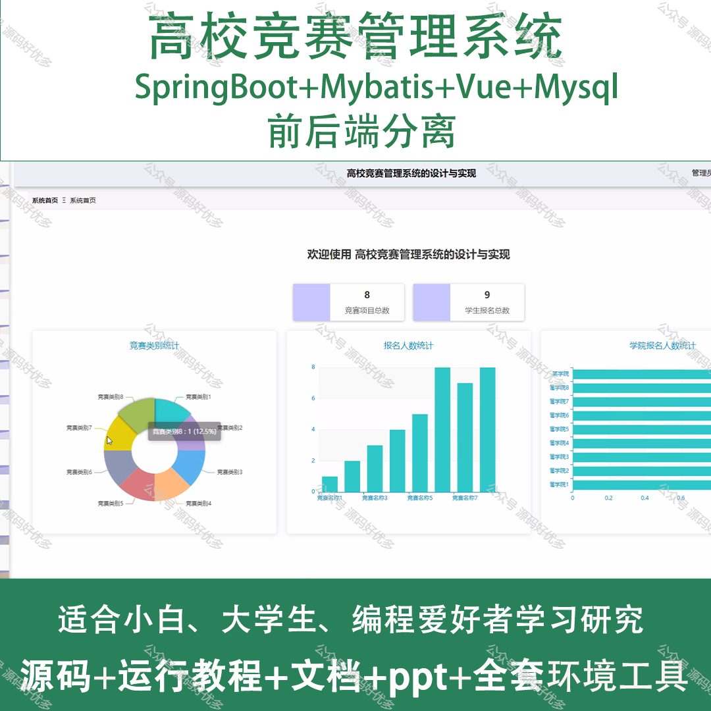
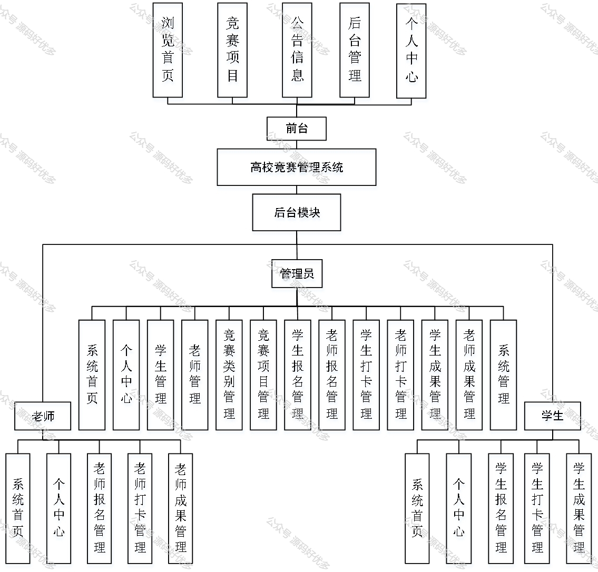
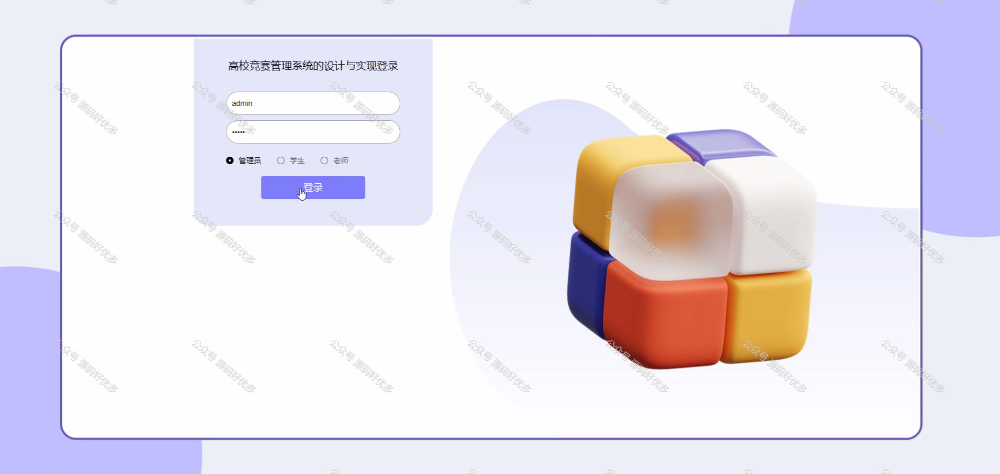
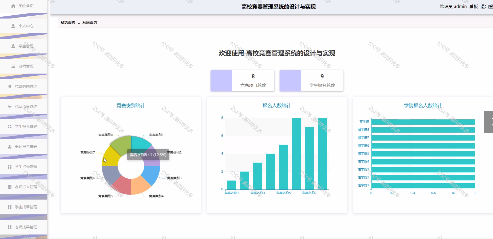
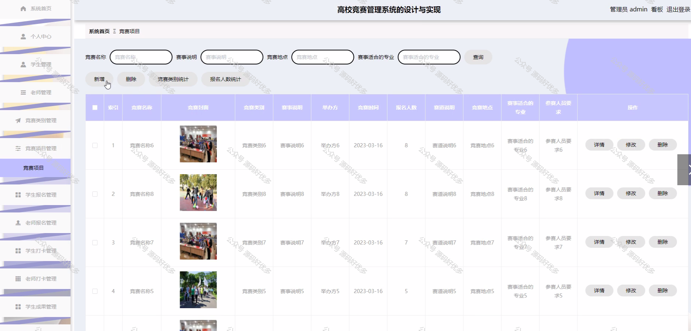
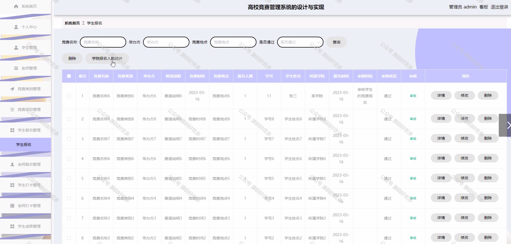
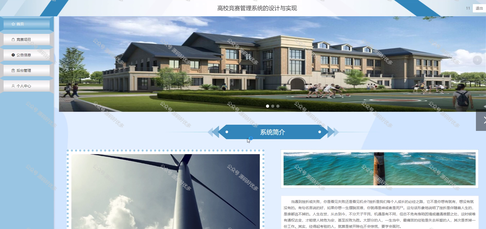
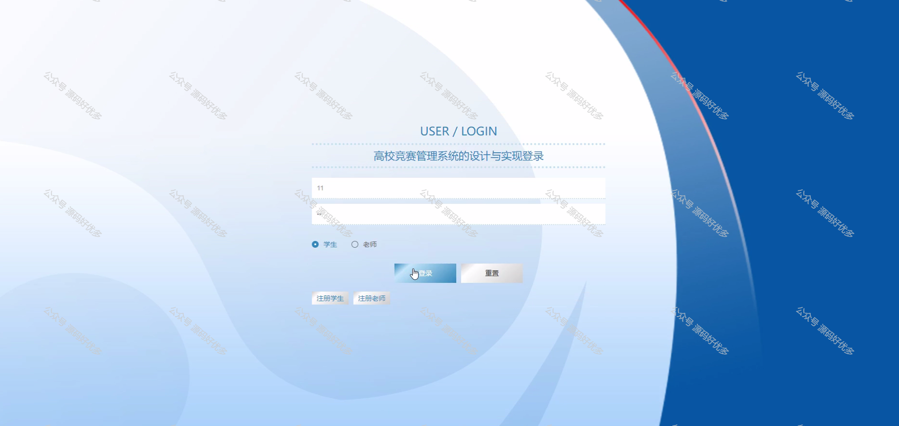
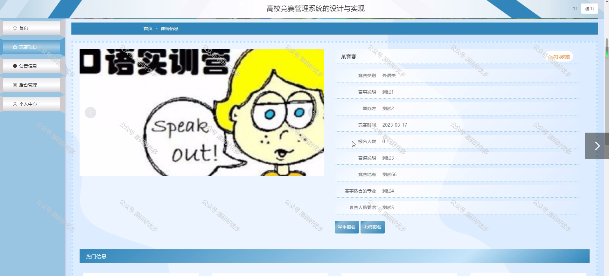
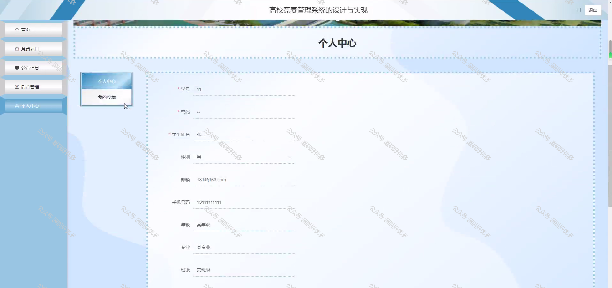
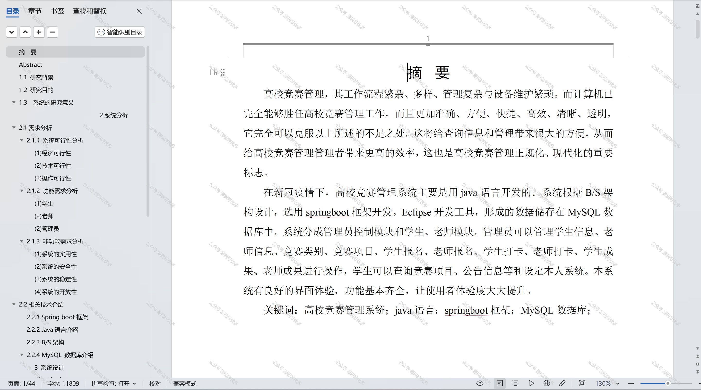

  
